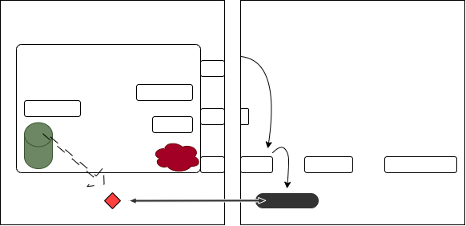

# COMP2150  - Level Design Document
### Name: Federica Botte
### Student number: 47184868

This document discusses and reflects on the design of your platformer level for the Level Design assessment. It should be 1500 words. Make sure you delete this and all other instructional text throughout the document before checking your word count prior to submission. Hint: You can check word count by copying this text into a Word or Google doc.

## 1. Player Experience (~700 words)

### 1.1. Discovery
Section One slowly introduces game mechanics one at a time, making the player use them almost instantly after discovery to learn game play dynamics. For example, in the starting space the player is faced with three platforms, a high one on the left and two short ones on the right, which immediately introduces them to the jump mechanic. The player instantly learns that the character can perform two different jump levels – short or long. They will gain this knowledge by trying to immediately high jump on to the left ledge or by doing a short jump on the lower right ledge and then aiming and jumping to the left one. Once the player realises there is no further way to go on the right, with spikes blocking them from movement, they will continue gameplay to the right. By the time the player clears Section One and reaches the first checkpoint they will have learnt all game mechanics which they can now combine and use to finish the level. The player is never explicitly told through instruction how to play, they learn by doing and moving through the space.

### 1.2. Drama
Section One has two enemies (one Chomper and one Spitter), teaching the player the mechanics of how to defeat them. These encounters are separate, with low intensity, to give the player time to explore the scene and get their bearings. Once Section One is cleared the player is rewarded forced up in the scene. Here there is a build-up of tension as the player moves up and across on moving platforms, encountering no obstacles. This smooth tension is interrupted briefly as the player encounters a Spitter in the distance, which is an easy kill, giving a false sense of ease. When the player clears the moving platforms with topped up health they reach the first checkpoint, marking the beginning of Section Two. This section is placed inside a ‘box’ using the platforms to create a small, enclosed space, making the player feel cramped as the tension rises intensely by respawning Chompers, all while being spit on from an unseen Spitter on an above platform and trying to break through a wall. Once cleared and rewarded again, the player falls to checkpoint two, starting Section Three, which starts in a large open space to give them a sense of relief following the high intensity of the previous combat. After walking off the Section Two encounter, the player is then faced with one more high intensity battle on ‘Acid Bridge’ with respawning Chompers amongst tiers of enemies and more breakthrough walls. When successfully cleared, the player takes a long journey down on a moving platform to recalibrate and recuperate before reaching the end of the level. 

### 1.3. Challenge
After defeating the first three isolated enemies easily in Section One and feeling powerful, the player is then properly challenged in Section Two the ‘Acid Box’. While they are trying to break through a barrier to clear the section, they are also forced to combat multiple respawning Chompers all while being spit on from an above Spitter that they are not able to see or kill. They are blocked from simply running away from these enemies so they must reflexively use melee attacks to fight and escape simultaneously. This challenge is intense but not entirely too difficult. The player is then rewarded with health boxes to feel like they are in control and still able to progress. Section Three has a similar set up, where there are breakable barriers to clear the level and respawning Chompers, but there also tiers above the ‘battleground’ that allow the player to escape temporarily to problem-solve how to clear the section. The tiers also have rewards, one heath box and one key, which give the player a feeling of relief and power even within the challenge. 

 

### 1.4. Exploration
The spikes mentioned above that are placed to the left of the starting space (pictured) subconsciously show the player that the other spikes throughout the rest of gameplay act as guidance on where a path ends or where to go to move forward in the level – even if ‘forward’ means moving up, down, or left, instead of constantly right. The spikes are a deliberate choice with the use of moving platforms, as it still gives the player the sense that they can freely move around and explore. The platforms push the player in the correct direction, but each section is multilayered, giving the opportunity to move up and down to follow a non-linear path and still go in the right direction. 
The first key is in the direct path of the player, the second key is in view, but the player must jump to it, and the final key is not in direct sight for the player. This intentional ramp up of visibility forces the player to explore the space to find the final key, which also increases difficulty in this section. Also, in Section Two, the unseen Spitter above the player lets them know there is another tier that they can potentially explore, if they do happen to explore this, they are rewarded with three health boxes. Rewarding them in this way encourages further exploration of the level when more seemingly unreachable places arise in Section Three. 

 
 
 

## 2. Core Gameplay (~400 words)
2.1. Spikes
 When the player jumps up on the left side of the opening chamber they end up on a platform with spikes on the edge. They can see a Chomper on another ledge on the bottom left corner. If they try to get to this platform they are spiked and learn that they spikes are dangerous to the character. They then will retreat and continue gameplay to the right.

 

2.2. Passthrough Platforms
 When the player jumps up from the bottom left platform to the top one, they learn of passthrough platforms. If they jump across to the right and miss this, they have the opportunity to learn again after they pick up the gun. 

2.3. Weapon Pickup (Staff) + Chompers
 The weapon pickup (staff) was placed in the opening chamber directly under the path to leave so the play was essentially forced to walk into it. The play is then immediately met with a Chomper once they leave the chamber to introduce the melee attack using the weapon they just acquired.
 
 I originally wanted to put the gun as the first item, but it was not obvious enough when play-tested that an item was picked up, so I swapped it out for the staff, which was more successful/obvious. 

 

2.4. Moving Platforms
 The player is introduced to moving platforms as they can see a health box from the starting chamber but cannot reach it from there. Once they leave the chamber they are faced with a gap in platforms/space to walk, where they will notice the moving platform, which is moving in the direction of the health box they saw earlier. 

  

2.5 Acid
 If the player fails to use the melee attack on the Chomper and get attacked by it, they will fall into the acid pit and be forced to start over after losing a life point. 
 
 Alternatively, if they do attack the Chomper and choose to jump in they will also be faced with starting over and a loss of life.

 

2.6. Weapon Pickup (Gun) + Spitters
 After the player clears the melee attack on the Chomper they will notice another skeleton like the one in the first chamber, they will then be inclined to collect the item from it. Simultaneously, they are faced with a Spitter which will start to attack. This new type of enemy as well as the new weapon will teach them the mechanic of the gun.

 

2.7. Breakable Barriers + Keys
 After defeating the Spitter, the player is faced with a block that they cannot jump over or get around. They will be forced through it by hitting it repeatedly with the melee attack. 
 
 Once through the player will immediately pick up the key that is in their immediate path, teaching them that they will be collecting two others by the icons in the top right corner of the screen.

 

2.8. Health Points
 If the player did not need or go back for the first health point under the starting chamber, they will find another on their way up the moving platforms once they clear the initial enemies. 

 

2.8. Checkpoints
 Once the player clears the moving platforms and starts Section Two, they are forced into the first checkpoint, which lights up showing them that it is activated. When they encounter the next one, they will know to run into it.

 

## 3. Spatiotemporal Design

### 3.1. Molecule Diagram

### 3.2. Level Map – Section 1

### 3.3.	Level Map – Section 2

### 3.4.	Level Map – Section 3

## 4. Iterative Design (~400 words)
Iterative design was instrumental in the development of my level, however my approach to this design was non-traditional – in that I did not produce early grey boxed specs and work from there. My approach to iteration was to create, test, recreate, and retest until I was satisfied. Once satisfied I had another person playtest, provide feedback, to which I would recreate and retest until I felt my design was what I wanted for the level. I initially started with a brainstormed idea that I had recorded verbally through a voice note that I had sent to myself. This approach worked for me for this project though I understand it is not a feasible approach to all design projects, however I do believe my outcome was successful and fit the scope of my initial 1.5 seconds of rambling in the voice notes. Had I not used an iterative approach, as unconventional as it was, and went with my initial layout then my game would have been very short and near impossible to complete. With my respawning enemies in Section Two and Three, had I not trial-and-errored the number of respawns versus number of respawn locations, balanced with the respawn time and initial enemies, then the player would have been overwhelmed with enemies and given up. Early layouts were also linear and without reason, through iterations I changed direction of gameplay with more purpose. At first all three sections simply followed each other however they flowed, but once I play tested and watched others playtest, I decided to have the layout of the map have more meaning. After section one the player goes upwards to build tension and then travel right through the first challenge to create unease, then fall to break tension and finally across and down to give the player a sense of recouperation before the end. All changes where to add subconscious senses to the player.

Although iteration was present in my design and significantly impactful, further iteration could improve my level further. Section Three specifically, on Acid Bridge, could go with further iteration. I provided the player with tiers above the bridge for brief periods of interval, but also included enemies in there to keep intensity and challenge high. After watching playtesters I could iterate more respite spots for the player to ‘catch their breath’ or play more with different levels, rather than having all tiers above the bridge. 

